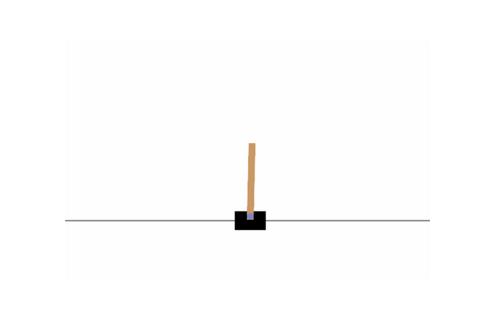
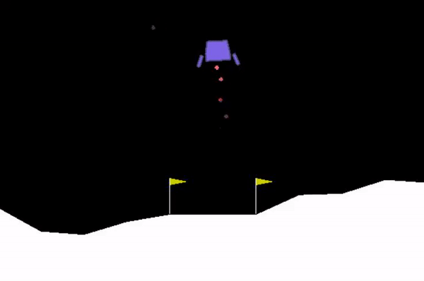

# Reinforcement Learning Projects with Gym

This repository contains three reinforcement learning projects using the OpenAI Gym environment. The projects focus on different algorithms and environments: Proximal Policy Optimization (PPO) for the CartPole-v1 environment and Deep Q-Network (DQN) for the LunarLander-v2 environment. 

## Visualization
### PPO - CartPole-v1


### DQN - LunarLander-v2


## Project Structure
- `PPO-2-CartPole-v1-play.py`: Visualize the performance of a trained PPO model on the CartPole-v1 environment.
- `PPO-2-CartPole-v1-train.py`: Train a PPO model on the CartPole-v1 environment.
- `DQN-LunarLander-v2.py`: Train and test a DQN agent on the LunarLander-v2 environment.

## Installation
### Install the required dependencies:
```bash
pip install gym torch numpy matplotlib
pip install swig
pip install box2d box2d-kengz --user
```

## Usage

### PPO - CartPole-v1
#### Training
To train a PPO model on the CartPole-v1 environment, run the following command:
```bash
python PPO-2-CartPole-v1-train.py
```
You can adjust the training parameters using command-line arguments. For example, to change the learning rate:
```bash
python PPO-2-CartPole-v1-train.py --lr 1e-3
```

#### Playing
To visualize the performance of the trained PPO model, run:
```bash
python PPO-2-CartPole-v1-play.py
```
You can also specify the model path, number of episodes, and game speed:
```bash
python PPO-2-CartPole-v1-play.py --model custom_model.pth --episodes 5 --speed 2.0
```

### DQN - LunarLander-v2
To train and test a DQN agent on the LunarLander-v2 environment, run:
```bash
python DQN-LunarLander-v2.py
```

## Contributing
Contributions are welcome! Please feel free to open an issue or submit a pull request.
